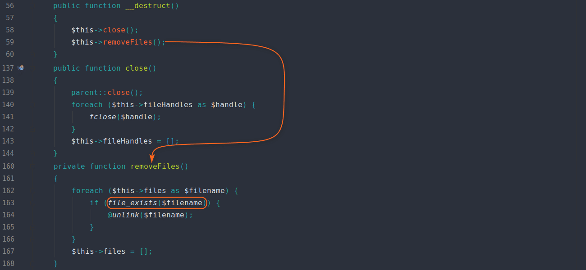
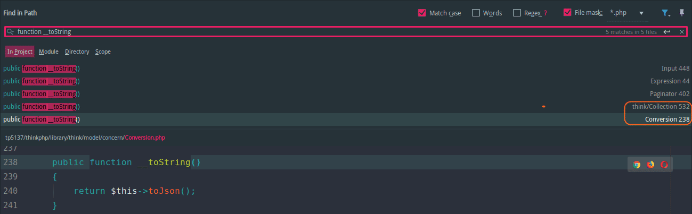
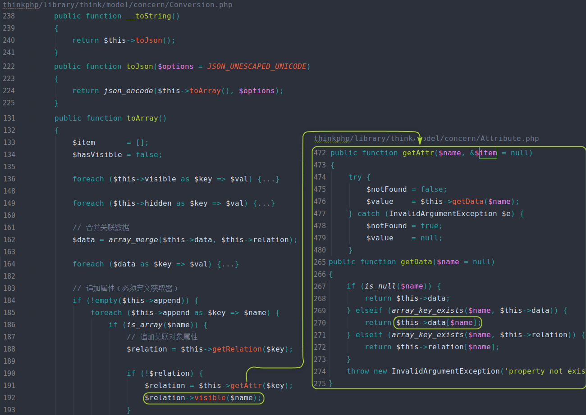
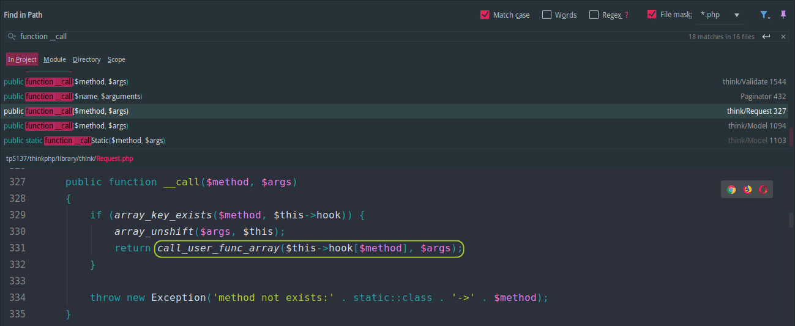
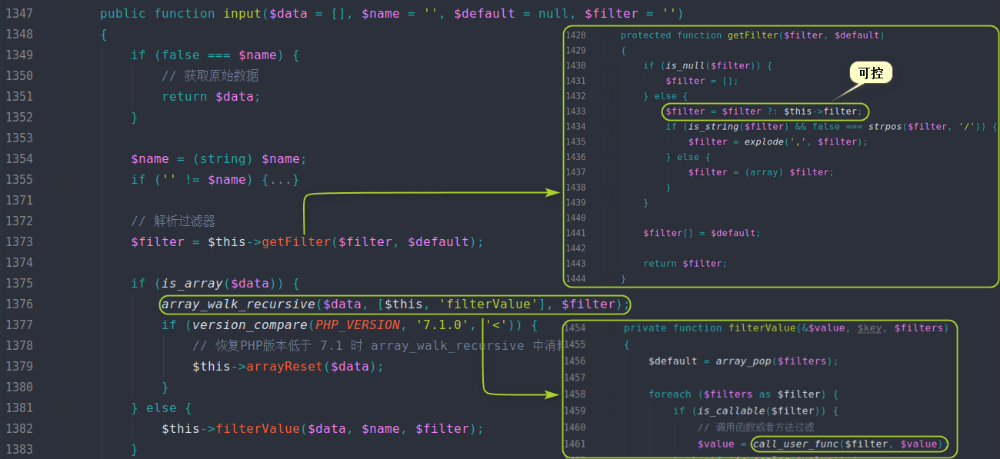
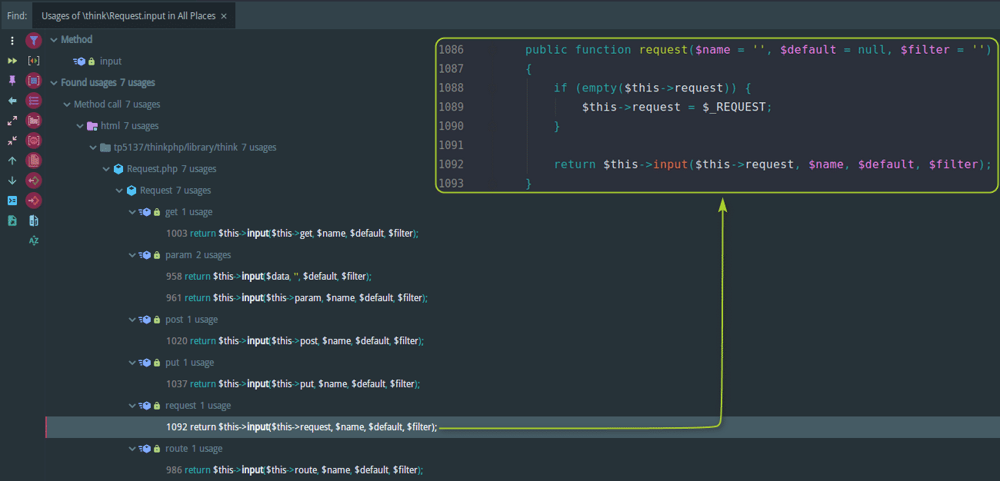
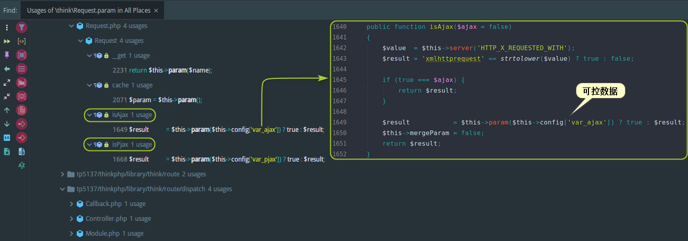
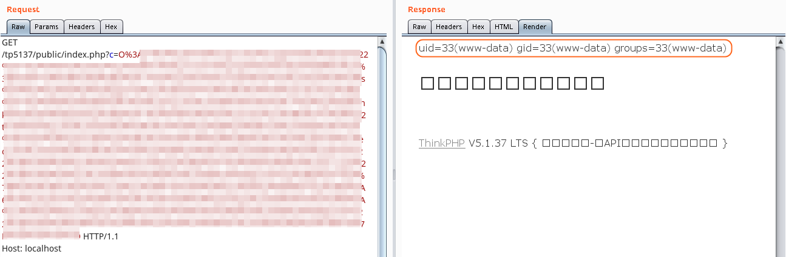
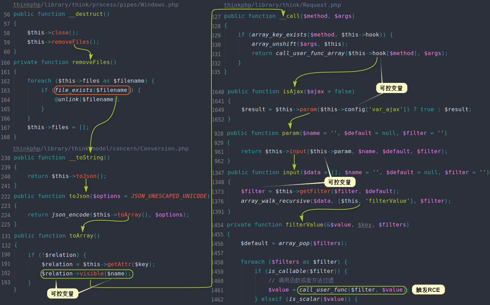

本系列文章将针对 **ThinkPHP** 的历史漏洞进行分析，今后爆出的所有 **ThinkPHP** 漏洞分析，也将更新于 [ThinkPHP-Vuln](https://github.com/Mochazz/ThinkPHP-Vuln) 项目上。本篇文章，将分析存在于 **ThinkPHP 5.1.X** 中的反序列化利用链。

## 环境搭建

```bash
➜  composer create-project --prefer-dist topthink/think tp5137
➜  cd tp5137
➜  vim composer.json # 把"topthink/framework": "5.1.*"改成"topthink/framework": "5.1.37"
➜  composer update
```

将 **application/index/controller/Index.php** 代码修改成如下：

```php
<?php
namespace app\index\controller;

class Index
{
    public function index()
    {
        $u = unserialize($_GET['c']);
        return 'hhh';
    }

    public function hello($name = 'ThinkPHP5')
    {
        return 'hello,' . $name;
    }
}
```

## 利用条件

- 有一个内容完全可控的反序列化点，例如： `unserialize(可控变量)` 

- 存在文件上传、文件名完全可控、使用了文件操作函数，例如： `file_exists('phar://恶意文件')` 

（满足以上任意一个条件即可）

## 漏洞链

这个漏洞个人认为比较有意思的是：通过 **file_exists** 函数触发类的 **__toString** 方法。下面，我们具体分析一下整个漏洞攻击链。

在 **think\process\pipes\Windows** 类的 **__destruct** 方法中，存在一个删除文件功能，而这里的文件名 **$filename** 变量是可控。如果我们将一个类赋值给 **$filename** 变量，那么在 **file_exists($filename)** 的时候，就会触发这个类的 **__toString** 方法。因为 **file_exists** 函数需要的是一个字符串类型的参数，如果传入一个对象，就会先调用该类 **__toString** 方法，将其转换成字符串，然后再判断。



接下来，我们就来寻找可利用的 **__toString** 方法。全局搜索到的 **__toString** 方法其实不多，这里有两处都可以利用。它们的区别在于利用 **think\Collection** 构造的链要多构造一步，我们这里只分析链较短的 **think\model\concern\Conversion** 。



如下图 **第191-192行** 所示，**$relation** 变量来自 **$this->data[$name]** ，而这个变量是可以控制的。**第192行** 的 **$name** 变量来自 **$this->append** ，也是可以控制的。所以 **$relation->visible($name)** 就变成了：**可控类->visible(可控变量)** 。那么接下来，就要找可利用的 **visible** 方法，或者没有 **visible** 方法，但有可利用的 **__call** 方法。



全局搜了一下 **visible** 方法大概有3处，但是都不能利用，所以我们考虑寻找可利用的 **__call** 方法。在搜 **__call** 方法的时候，会发现有一处 **think\Request**类比较好利用，因为这里 **call_user_func_array** 函数的第一个参数完全可控。构造 **EXP** 的时候可以传入数组，变成  **call_user_func_array(array(任意类,任意方法),$args)** ，这样我们就可以调用任意类的任意方法了。虽然第330行用 **array_unshift** 函数把本类对象 **$this** 放在数组变量 **$args** 的第一个，但是我们可以寻找不受这个参数影响的方法。



分析过 **ThinkPHP** 历史 **RCE** 漏洞的人可能知道， **think\Request** 类的 **input** 方法经常是链中一个非常棒的 **Gadget** ，相当于 **call_user_func($filter,$data)** 。但是前面我们说过， **$args** 数组变量的第一个元素，是一个固定死的类对象，所以这里我们不能直接调用 **input** 方法，而应该寻找调用 **input** 的方法。



调用 **input** 的方法共有7处，我这里直接选择比较简单的 **request** 方法来分析，因为这7处关键代码都类似。如果这里通过调用 **request** 方法间接调用 **input** 方法，实际上框架会报错退出的。因为这里传给 **input** 方法的 **$name** （下图右边第1092行），实际上是先前  **call_user_func_array(array(任意类,任意方法),$args)** 中 **$args** 数组的第一个变量，即我们前面说的一个固定死的类对象。然而如果把一个类对象作为 **$data** 传给 **input** 方法，那么在强转成字符串的时候（上图左边1354行），框架就会报错退出。



所以我们这里还要继续找有哪些地方调用了这7处。这里搜了调用 **param** 方法的地方，发现 **isAjax** 和 **isPjax** 都可以利用，因为他们传入 **param** 方法的第一个参数均可控。



这样，整个漏洞链就构造完了。下面举个例子，比如我们想执行 **system('id')** 代码，那么我们只要让传入的 **Request** 对象的 **$this->filter='system'** 且 **$this->param=array('id')** 即可，所以最终 **EXP** 如下（不同版本EXP不一样）：

```php
已删除
```



最后整理一下攻击链的流程图：



## 参考

[挖掘暗藏thinkphp中的反序列利用链](https://blog.riskivy.com/%e6%8c%96%e6%8e%98%e6%9a%97%e8%97%8fthinkphp%e4%b8%ad%e7%9a%84%e5%8f%8d%e5%ba%8f%e5%88%97%e5%88%a9%e7%94%a8%e9%93%be/) 