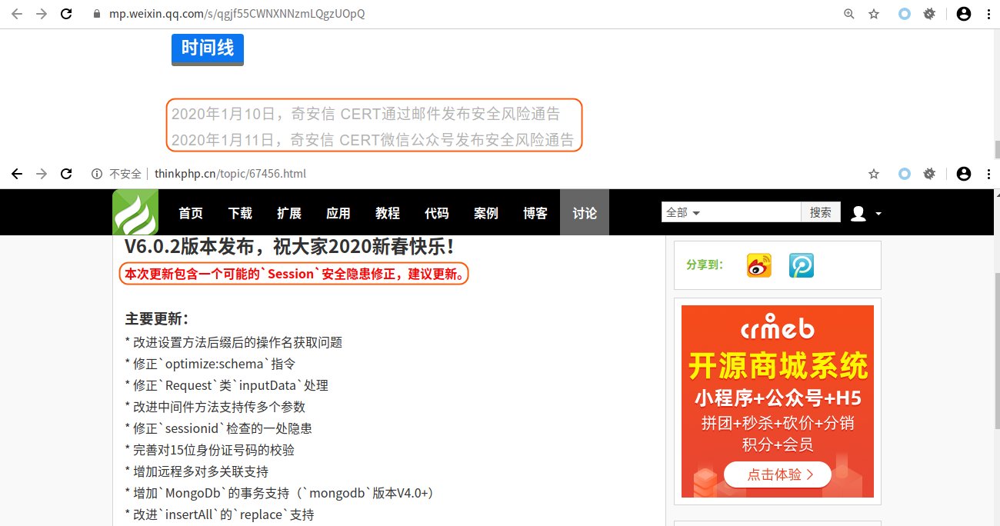
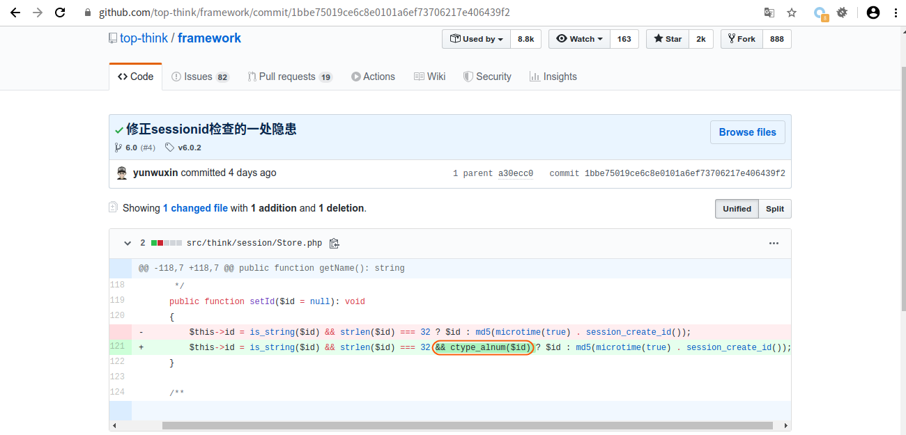
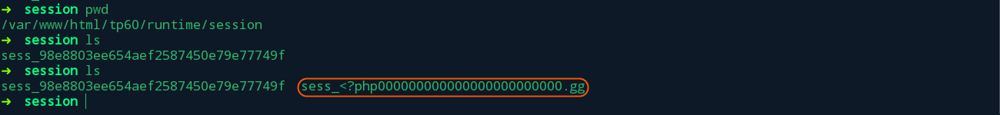
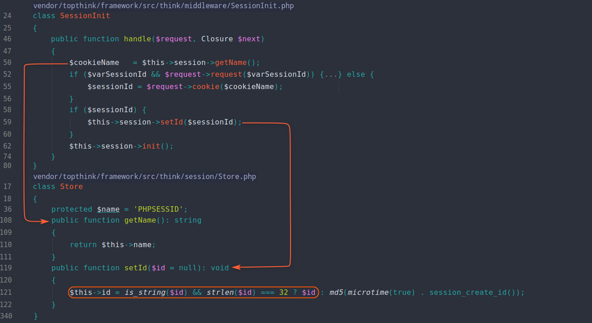
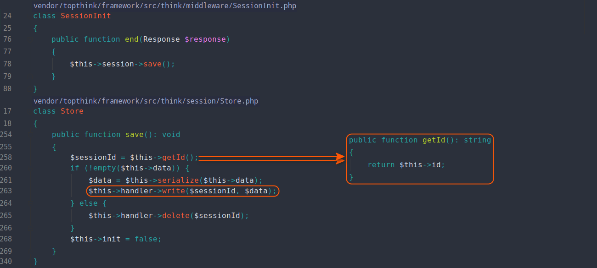
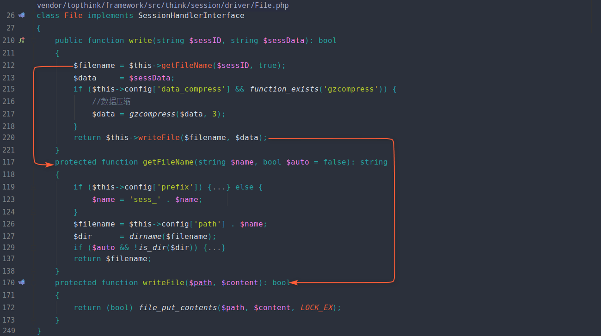
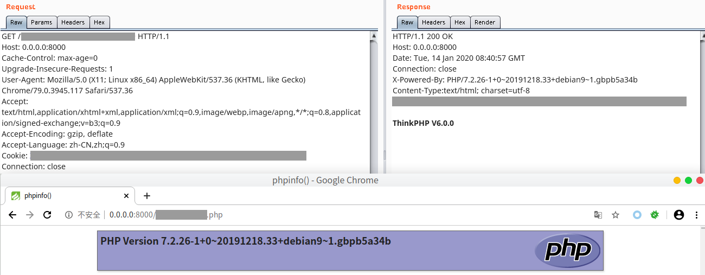

本系列文章将针对 **ThinkPHP** 的历史漏洞进行分析，今后爆出的所有 **ThinkPHP** 漏洞分析，也将更新于 [ThinkPHP-Vuln](https://github.com/Mochazz/ThinkPHP-Vuln) 项目上。本篇文章，将分析存在于 **ThinkPHP6.0.X** 中的 **任意文件创建** 漏洞，漏洞影响 **ThinkPHP6.0.0、6.0.1** 。

## 漏洞环境

```bash
➜  html composer create-project topthink/think tp60
```

将 **tp60/composer.json** 文件的 **"topthink/framework": "^6.0.*",** 改成 **6.0.0** 版本，并执行如下命令。

```bash
➜  tp60 composer update
➜  tp60 ./think run --host=0.0.0.0 --port=8000
```

修改 **/var/www/html/tp60/app/controller/Index.php** 文件如下：

```php
<?php
namespace app\controller;

use app\BaseController;

class Index extends BaseController
{
    public function index()
    {
        session('demo', $_GET['c']);
        return 'ThinkPHP V6.0.0';
    }

    public function hello($name = 'ThinkPHP6')
    {
        return 'hello,' . $name;
    }
}
```

修改 **/var/www/html/tp60/app/middleware.php** 文件如下（开启Session功能，可参考： https://www.kancloud.cn/manual/thinkphp6_0/1037635 ）

```php
<?php
// 全局中间件定义文件
return [
    // 全局请求缓存
    // \think\middleware\CheckRequestCache::class,
    // 多语言加载
    // \think\middleware\LoadLangPack::class,
    // Session初始化
     \think\middleware\SessionInit::class
];
```

## 漏洞分析

根据漏洞通告的时间线及官方的更新简述，我们可以从相近时间线的 **commit** 开始看起。



这里我们关注到更新中包含一个可能的 `Session` 安全隐患修正，我们看其具体代码。可以发现修复代码中主要多了 **ctype_alnum($id)** ，只允许 **$id** 由字母和数字构成。



再看 **奇安信 CERT** 对于漏洞的描述：

>近日，奇安信补天漏洞响应平台收到ThinkPHP 6.0 “任意”文件创建漏洞，该漏洞源于ThinkPHP 6.0的某个逻辑漏洞，成功利用此漏洞的攻击者可以实现“任意”文件创建或覆盖，可能造成 Web 应用被破坏（远程拒绝服务），特殊场景下还可造成 GetShell。建议各单位自查，并尽快升级至修复版本。

所以我们很容易想到该漏洞可能和文件存储 **session** 有关。我们发送正常数据包时，会发现 **session** 文件默认存储在 **/var/www/html/tp60/runtime/session** 下，其文件名格式类似 **sess_PHPSESSID** 。而当我们在 **PHPSESSID** 中插入特殊字符时，程序还是能正常生成对应文件。因此，这里存在任意文件创建漏洞，且通过插入路径穿越符，还存在文件覆盖和getshell的可能。



下面我们来看具体的漏洞代码。在 **session** 初始化时，程序会将 **PHPSESSID** 对应的值赋值给 **\think\session\Store:id** 。这里如果 **PHPSESSID** 对应值长度等于32，则无任何过滤直接赋值。



然后在程序构造响应数据返回给用户时，会先将 **session** 写入文件，而这个文件的文件名则由之前的  **PHPSESSID** 拼接而成。由于没有任何的过滤，这也就造成了任意文件创建、覆盖。如果在 **session** 数据可控的情况下，还能达到 **getshell** 的目的。





最终利用效果如下：

